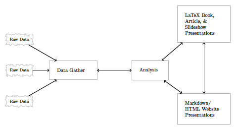

```{r setup, include=FALSE}
knitr::opts_chunk$set(echo = T,eval=T)
lapply(c("tidyverse","haven","lubridate","janitor","readxl",
                     "stringr", "magrittr"),require,character.only=T)
```


# Nunca esqueça 

## Pacotes e diretório de trabalho

```{r,eval=F} 
lista.de.pacotes = c("tidyverse","haven","lubridate","janitor","readxl",
                     "stringr", "magrittr") # escreva a lista de pacotes

novos.pacotes <- lista.de.pacotes[!(lista.de.pacotes %in%
                                      installed.packages()[,"Package"])]
if(length(novos.pacotes) > 0) {install.packages(novos.pacotes)}
lapply(lista.de.pacotes, require, character.only=T)
#rm(lista.de.pacotes,novos.pacotes)
rm(list = ls())
gc()


# Definiindo o diretorio de trabalho como do arquivo local
setwd(dirname(rstudioapi::getActiveDocumentContext()$path))

setwd("/Volumes/Macintosh HD/MQCP_IPOL_2020/Slides/aula 04") # mmudando meu direto

```  
 


# O Universo tidyverse


## Manifesto tidyverse


- Reutilizar estruturas de dados existentes.

- Organizar funções simples usando o pipe.

- Aderir à programação funcional.

- Projetado para ser usado por seres humanos.


## Manifesto tidy

- Tidy Tools Manifesto <https://cran.r-project.org/web/packages/tidyverse/vignettes/manifesto.html>

- Tidy data vignette <https://cran.r-project.org/web/packages/tidyr/vignettes/tidy-data.html>

- Tidy Data paper <http://vita.had.co.nz/papers/tidy-data.pdf>

- Conjunto de pacotes <https://www.tidyverse.org/packages/>


## Conjunto de dados

Vamos trabalhar com a base `decisoes`, que contém decisões do Tribunal de Justiça de São Paulo


```{r}

decisoes <- read_rds("dados/decisoes.rds") %>%
  janitor::clean_names() # com dois pontos eu não preciso usar library
glimpse(decisoes)

```


## Características do `dplyr`


- A utilização é facilitada com o emprego do operador `%>%`


- No primeiro argumento colocamos o `data.frame` ou o `tibble`, e nos outros argumentos colocamos o que queremos fazer.


## As cinco funções principais do `dplyr`

- `select`: selecionar colunas

- `filter`: filtrar linhas

- `mutate`: criar colunas

- `summarise`: sumarizar colunas

- `arrange`: ordenar linhas


# tydyr


## Alterando o formato de dados

Até agora, estudamos os principais ferramentas de transformação de dados do `dplyr`. Agora vamos aumentar nossa caixa-de-ferramentas com `tidyr`


- Carregando uma nova base de dados, que completa a de decisões.

```{r echo=TRUE}
processos <- read_rds("dados/processos_nested.rds")
```


## Fomato tidy

- Hadley Wickham <http://r4ds.had.co.nz/tidy-data.html>


## Funções do pacote


- Enquanto o `dplyr` faz recortes na base (com `filter()`e `select()`) e adições simples (`mutate()`, `summarise()`), o `tidyr` mexe no **formato** da tabela (`gather()`, `spread()`) e faz modificações menos triviais.


- As funções do `tidyr` geralmente vêm em pares com seus inversos:
    - `gather()` e `spread()`, -> substituídas por `pivot_longer` e `pivot_wider`
    - `nest()` e `unnest()`,
    - `separate()` e `unite()`


## Onde estamos


<http://r4ds.had.co.nz/wrangle-intro.html>

```{r, out.width="90%", echo=FALSE, fig.align='center',eval=F}
knitr::include_graphics("imgs/wrangle.png")
```


## `gather()` 

- `gather()` empilha o banco de dados

- `pivot_longer` empilha de um jeito ainda mais fácil

```{r, warning=FALSE, message=FALSE}
decisoes %>% 
  filter(!is.na(id_decisao)) %>% 
  select(id_decisao:data_registro) %>% 
  # 1. nome da coluna que vai guardar os nomes de colunas empilhadas
  # 2. nome da coluna que vai guardar os valores das colunas
  # 3. seleção das colunas a serem empilhadas
  gather(key="variavel", value="valor", -id_decisao) %>% 
  arrange(id_decisao)
```

## `pivot_longer`

Base `relig_income` do `tidyr` 3 variáveis:

  - religion, nas linhas
  - income, nas colunas  e
  - count, nas células

```{r}
tidyr::relig_income
```

##

```{r}
tidyr::relig_income %>%
  pivot_longer(!religion, 
               names_to = "income", # diz a varável onde entrarão os nomes
               values_to = "count" # diz a variável onde entrarão os valores
               )
```


## `spread()`

- `spread()` espalha uma variável nas colunas e preenche com outra variável

- Função inversa de `gather`

- Bem mais fácil com `pivot_wider`

```{r}
decisoes %>% 
  filter(!is.na(id_decisao)) %>% 
  select(id_decisao:data_registro) %>% 
  gather(key, value, -id_decisao) %>% 
  # 1. coluna a ser espalhada
  # 2. valores da coluna
  spread(key, value)
```


## `pivot_wider`


```{r}
decisoes %>% 
  filter(!is.na(id_decisao)) %>% 
  select(id_decisao:data_registro) %>% 
  pivot_longer(!id_decisao, 
               names_to = "tipo", # diz a varável onde entrarão os nomes
               values_to = "info" # diz a variável onde entrarão os valores
               ) %>% 
  # 1. coluna a ser espalhada
  # 2. valores da coluna
  pivot_wider(names_from = "tipo",
              values_from = "info")
```


## 

- Qual juiz julga a maior proporção de processos que tratam de drogas

 -- Dica: construa um `data.frame` contendo as colunas juiz, n_processos_drogas, n_processos_n_drogas e total_processos, remodelando os dados para haver um juiz por linha e utilizando `spread()`
    
## Resolução

```{r,echo=F}
decisoes %>% 
  filter(!is.na(txt_decisao)) %>%
  mutate(txt_decisao = tolower(txt_decisao),
         droga = str_detect(txt_decisao,
    "droga|entorpecente|psicotr[óo]pico|maconha|haxixe|coca[íi]na"),
    texto_droga=case_when(
      droga==TRUE ~ "droga",
      droga==FALSE ~ "n_droga"
    )) %>%
  group_by(juiz,texto_droga) %>%
  summarise(n=n()) %>%
  spread(texto_droga,n,fill = 0) %>%
  mutate(total=droga+n_droga,
         proporcao=droga/total) %>%
  arrange(desc(proporcao))
  
  
```

## 

- Qual quantidade mensal de decisões por juiz?

- Dica: use `data_decisao` `dmy()` e `month()`
    
## 

```{r,eval=F}
decisoes %>% 
  filter(!is.na(txt_decisao)) %>%
  mutate(txt_decisao = tolower(txt_decisao),
         droga = str_detect(txt_decisao,
    "droga|entorpecente|psicotr[óo]pico|maconha|haxixe|coca[íi]na"),
    droga=case_when(
      droga==TRUE ~ "droga",
      droga==FALSE ~ "n_droga"
    )) %>%
  group_by(juiz,droga) %>%
  summarise(n=n()) %>%
  spread(droga,n,fill = 0) %>%
  mutate(total=droga+n_droga,
         proporcao=droga/total)
  
  
```


## Resultado


```{r,echo=F}
decisoes %>% 
  filter(!is.na(txt_decisao)) %>%
  mutate(txt_decisao = tolower(txt_decisao),
         droga = str_detect(txt_decisao,
    "droga|entorpecente|psicotr[óo]pico|maconha|haxixe|coca[íi]na"),
    droga=case_when(
      droga==TRUE ~ "droga",
      droga==FALSE ~ "n_droga"
    )) %>%
  group_by(juiz,droga) %>%
  summarise(n=n()) %>%
  spread(droga,n,fill = 0) %>%
  mutate(total=droga+n_droga,
         proporcao=droga/total)
  
  
```


## Exemplo para o ggplot


## Unindo e separando colunas

- `unite` junta duas ou mais colunas usando algum separador (`_`, por exemplo).
- `separate` faz o inverso de `unite`, e uma coluna em várias usando um separador.

## Exemplo de separação de colunas

- Olhe os valores da variável classe_assunto


## Exemplo de separação de colunas

- Vamos separar a coluna classe_assunto em duas colunas

- coluna classe e coluna assunto

- Existe separador? -> sim, `/`

- Usei count apenas em assunto


## Em ação

```{r,eval=F}
decisoes %>% 
  select(n_processo, classe_assunto) %>% 
  separate(classe_assunto, c('classe', 'assunto'), sep = ' / ', 
           extra = 'merge', fill = 'right') %>% 
  count(assunto, sort = TRUE)

## count é um jeito resumido de usar group_by() %>% summarise(n())
```

## Em ação
```{r,echo=F}
decisoes %>% 
  select(n_processo, classe_assunto) %>% 
  separate(classe_assunto, c('classe', 'assunto'), sep = ' / ', 
           extra = 'merge', fill = 'right') %>% 
  count(assunto, sort = TRUE)


```


## List columns: `nest()` e `unnest()`

`nest()` e `unnest()` são operações inversas e servem para tratar dados complexos, como o que temos em `processos`

```{r}
d_partes <- processos %>% 
  select(n_processo, partes) %>% 
  unnest(partes)
```

## 

As list columns são uma forma condensada de guardar dados que estariam em múltiplas tabelas. Por exemplo, uma alternativa à colocar as `partes` numa list column seria guardar a tabela `d_partes` separadamente.

```{r}

glimpse(d_partes)
```


## Duplicatas

Para retirar duplicatas, utilizar `distinct`. Ele considera apenas a primeira linha em que encontra um padrão para as combinações de variáveis escolhidas e descarta as demais.

```{r echo=TRUE}
decisoes %>% 
  distinct(municipio)
```

## Por coluna

Para manter as demais colunas, use `.keep_all=`:

```{r echo=TRUE}
decisoes %>%
  distinct(municipio, camara, 
           .keep_all = TRUE)
```

## `janitor::get_dupes()`

Use `janitor::get_dupes()` para averiguar os casos em que há repetição de combinações de colunas.

```{r echo=TRUE}
decisoes %>% 
  get_dupes(n_processo)
```


# Joins

## Dados relacionais

- Hadley Wickham <http://r4ds.had.co.nz/relational-data.html>

## Principais funções 

Para juntar tabelas, usar `inner_join`, `left_join`, `anti_join`, etc. 

## Visualizando

```{r, out.width="90%", echo=FALSE, fig.align='center',eval=F}
knitr::include_graphics("imgs/join-venn.png")
```


## Exemplo de inner join:

```{r eval=F}
a <- decisoes %>% 
  filter(data_registro == "18/01/2018", !is.na(id_decisao)) %>% 
  select(id_decisao, n_processo) %>% 
  inner_join(processos, "n_processo")
```

##
```{r echo=F}
decisoes %>% 
  filter(data_registro == "18/01/2018", !is.na(id_decisao)) %>% 
  select(id_decisao, n_processo) %>% 
  inner_join(processos, "n_processo")
```


## Exemplo de right join:


```{r eval=F}
b <- decisoes %>% 
  filter(data_registro == "18/01/2018", !is.na(id_decisao)) %>% 
  select(id_decisao, n_processo) %>% 
  right_join(processos, "n_processo")
```

##

```{r echo=F}
decisoes %>% 
  filter(data_registro == "18/01/2018", !is.na(id_decisao)) %>% 
  select(id_decisao, n_processo) %>% 
  right_join(processos, "n_processo")
```


# Limpeza

## Duplicatas

Para retirar duplicatas, utilizar `distinct`. Ele considera apenas a primeira linha em que encontra um padrão para as combinações de variáveis escolhidas e descarta as demais.

```{r eval=F}
decisoes %>% 
  distinct(municipio)
```

##

```{r echo=F}
decisoes %>% 
  distinct(municipio)
```


## Por coluna

Para manter as demais colunas, use `.keep_all=`:

```{r eval=F}
decisoes %>%
  distinct(municipio, camara, 
           .keep_all = TRUE)
```

##

```{r echo=F}
decisoes %>%
  distinct(municipio, camara, 
           .keep_all = TRUE)
```


## `janitor::get_dupes()`

Use `janitor::get_dupes()` para averiguar os casos em que há repetição de combinações de colunas.

```{r eval=F}
decisoes %>% 
  get_dupes(n_processo)
```


##

```{r echo=F}
decisoes %>% 
  get_dupes(n_processo)
```

## 

- [Janitor exemplos](http://sfirke.github.io/janitor/articles/janitor.html)

- [Missing e imputação](https://www.analyticsvidhya.com/blog/2016/03/tutorial-powerful-packages-imputing-missing-values/)

- [mice](https://amices.org/mice/)

- Outliers (critérios, limpeza e gráficos)

- `stringi` e `stringr`--> expressões regulares


# Pesquisa reproduzível

## Por quê?

- Pra ciência

- Pra você

## Ferramentas

- R e RStudio (ok)

- Github

- knitr e rmarkdown

- LaTeX


## Fluxo de trabalho

1. Coleta

2. Análise

3. Comunicação


##


```{r, out.width="100%", echo=FALSE, fig.align='center',eval=T}

```


## Dicas


1. Documente tudo!

2. Tudo é um arquivo (de texto).

3. Todos os arquivos devem ser legíveis (por humanos).

4. Relacione explicitamente seus arquivos.

5. Tenha um plano para organizar, armazenar e disponibilizar seus arquivos.

# Versionando projetos

##


```{r, out.width="80%", echo=FALSE, fig.align='center',eval=F}
knitr::include_graphics("imgs/fluxo_github_rstudio.png")
```


## Repositório: Criação de repositório do projeto no Github


```{r, out.width="80%", echo=FALSE, fig.align='center',eval=F}
knitr::include_graphics("imgs/passo_1_criar_repo.gif")
```


## .Rproj: Criação do Projeto no RStudio


```{r, out.width="80%", echo=FALSE, fig.align='center',eval=F}
knitr::include_graphics("imgs/passo_2_criacao_do_rproj_pt2.gif")
```


## Commit: Editando e “Commitando” as mudanças no código


```{r, out.width="80%", echo=FALSE, fig.align='center',eval=F}
knitr::include_graphics("imgs/passo_3_commit_1.gif")
```


## Push: Subindo os commits para o Github


```{r, out.width="80%", echo=FALSE, fig.align='center',eval=F}
knitr::include_graphics("imgs/passo_4_push.gif")
```


## Pull: Baixando o estado atual do projeto


```{r, out.width="80%", echo=FALSE, fig.align='center',eval=F}
knitr::include_graphics("imgs/passo_5_pull.gif")
```


# ioslides no Rmarkdown

## Trabalhando com slides no RMarkdown

- Manual <https://rmarkdown.rstudio.com/lesson-11.html>

- Galeria <https://rmarkdown.rstudio.com/gallery.html>

File ==> New file ==> R Markdown ==> Presentation

- HTML (ioslides)

## Trabalhando no .rmd

- Opções e detalhes do ioslides <https://rmarkdown.rstudio.com/ioslides_presentation_format#overview>

- Mais referências <https://bookdown.org/yihui/rmarkdown/ioslides-presentation.html>

- Montando o arquivo `ìndex.rmd`


## gh-pages

- novo "branch"

- nome `gh-pages`

- arquivo `ìndex.html` precisa estar na raiz

- a cada alteração de `ìndex.rmd` e `ìndex.html`, merge de master para gh-pages OU SIMPLESMENTE apague o branch e recrie o gh-pages

- Suestão: só crie o branch gh-pages quando concluir seu trabalho e fizer o  

- Seu site estará no endereço ==> nome_de_usuario.github.io/nome_do_repositorio/

- ATENÇÃO: não esqueça da barra final no endereço


# Gerenciamento de arquivos
